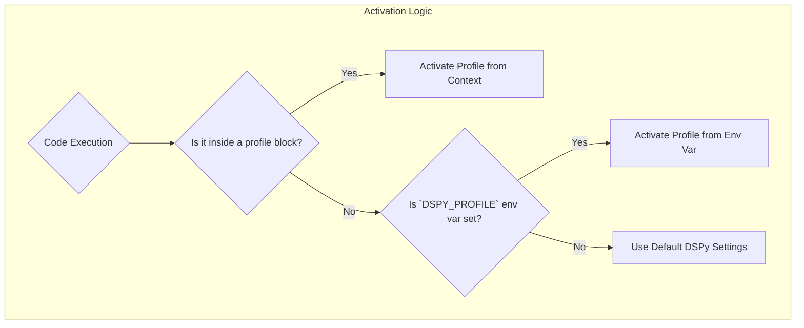

# Advanced Usage

This section covers more advanced features and use cases for `dspy-profiles`.

## Complex Profile Examples

While the `init` command is great for getting started, your `profiles.toml` file can grow to handle much more complex scenarios.

### Configuring Different LMs

You can configure any language model that DSPy supports. Here's an example of configuring a local Ollama model:

```toml title="~/.dspy/profiles.toml"
[local_mistral]
[local_mistral.lm]
class_name = "dspy.OllamaLocal"
model = "mistral"
max_tokens = 4096
```

### Configuring Retrieval Models

Configuring a retrieval model like `ColBERTv2` is just as easy. This is where profiles become incredibly powerful, as you can switch your entire retrieval backend with a single word.

```toml title="~/.dspy/profiles.toml"
[dev_retrieval]
[dev_retrieval.rm]
class_name = "dspy.ColBERTv2"
url = "http://localhost:8893/api/search"
```

## Activation Precedence

`dspy-profiles` uses a clear and predictable order of precedence to determine which profile is active. This ensures that you always know which configuration is being used.

The order is as follows:

1.  **`profile()` Context Manager / `@with_profile` Decorator**: The most specific and highest precedence.
2.  **`DSPY_PROFILE` Environment Variable**: If set, this profile will be used. This is what the `dspy-profiles run` command uses internally.
3.  **Default DSPy Configuration**: If neither of the above is present, the standard DSPy environment variables (`OPENAI_API_KEY`, etc.) or manually configured settings will be used.



## Programmatic Access

You can programmatically access profile information, which is useful for introspection or for building more complex workflows.

### Getting the Current Profile

The `current_profile()` function returns the name of the currently active profile, if any.

```python
from dspy_profiles import profile, current_profile

print(f"Outside context: {current_profile()}")

with profile("my_profile"):
    print(f"Inside context: {current_profile()}")

# Output:
# Outside context: None
# Inside context: my_profile
```

### Loading a Profile's Configuration

The `get_profile()` function allows you to load the fully resolved configuration of any profile as a dictionary.

```python
from dspy_profiles import get_profile

config = get_profile("my_profile")
print(config)

# Output:
# {'lm': {'model': 'gpt-4o-mini'}, 'settings': {'temperature': 0.7}}
```

## Importing from .env Files

The `dspy-profiles import` command allows you to create a new profile directly from a `.env` file. This is particularly useful for migrating existing DSPy projects or for teams that use `.env` files for environment management.

The command works by reading a `.env` file and looking for variables with the `DSPY_` prefix. It then converts these variables into a profile, following a simple mapping logic:

-   `DSPY_LM_MODEL` becomes `[profile.lm] model = "..."`
-   `DSPY_RM_URL` becomes `[profile.rm] url = "..."`
-   `DSPY_SETTINGS_CACHE_DIR` becomes `[profile.settings] cache_dir = "..."`

### Example

Imagine you have a `.env` file with the following content:

```bash title=".env"
# Language Model Settings
DSPY_LM_MODEL="openai/gpt-4o-mini"
DSPY_LM_API_KEY="sk-..."
DSPY_LM_API_BASE="https://api.openai.com/v1"

# Retrieval Model Settings
DSPY_RM_CLASS_NAME="dspy.ColBERTv2"
DSPY_RM_URL="http://localhost:8893/api/search"

# Other DSPy Settings
DSPY_SETTINGS_TEMPERATURE="0.7"
```

You can import this into a new profile named `from_env` with the following command:

```bash
dspy-profiles import --profile from_env --from .env
```

This will create a new `from_env` profile in your `profiles.toml` file. If your `profiles.toml` was empty, it would now look like this:

```toml title="profiles.toml"
[from_env]

[from_env.lm]
model = "openai/gpt-4o-mini"
api_key = "sk-..."
api_base = "https://api.openai.com/v1"

[from_env.rm]
class_name = "dspy.ColBERTv2"
url = "http://localhost:8893/api/search"

[from_env.settings]
temperature = "0.7"
```

You can then view the new profile with `dspy-profiles show from_env`.
