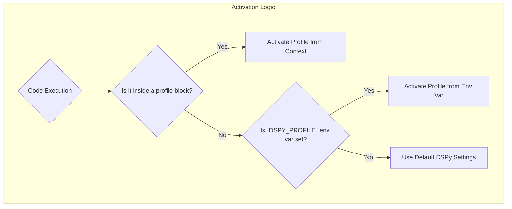

# Advanced Usage

This section covers more advanced features and use cases for `dspy-profiles`.

## Complex Profile Examples

While the `init` command is great for getting started, your `profiles.toml` file can grow to handle much more complex scenarios.

### Configuring Different LMs

You can configure any language model that DSPy supports. Here's an example of configuring a local Ollama model:

```toml title="~/.dspy/profiles.toml"
[local_mistral]
[local_mistral.lm]
class_name = "dspy.OllamaLocal"
model = "mistral"
max_tokens = 4096
```

### Configuring Retrieval Models

Configuring a retrieval model like `ColBERTv2` is just as easy. This is where profiles become incredibly powerful, as you can switch your entire retrieval backend with a single word.

```toml title="~/.dspy/profiles.toml"
[dev_retrieval]
[dev_retrieval.rm]
class_name = "dspy.ColBERTv2"
url = "http://localhost:8893/api/search"
```

## Understanding TOML Syntax: Two Ways to Write Your Profiles

When you look at TOML files, you might notice that people structure their data in a couple of different ways, especially when it comes to nested information. `dspy-profiles` is designed to be flexible and understands both common styles right out of the box. Let's break them down.

### Style 1: Nested Table Syntax (The Explicit Way)

This is the most structured way to write your configuration. You can think of it like creating folders and subfolders. For example, to define the `lm` (language model) settings for a profile named `my_profile`, you would create a "folder" called `my_profile.lm`.

This is great for clarity, especially when you have multiple sections in your profile (like `lm`, `rm`, and `settings`).

```toml title="Nested Table Syntax"
# This creates a 'my_profile' profile with an 'lm' section inside it.
[my_profile.lm]
model = "gpt-4o-mini"
temperature = 0.7

# You could also add a retrieval model like this:
[my_profile.rm]
model = "colbertv2.0"
```

### Style 2: Dotted Key Syntax (The Shortcut)

This style is more concise and is often used for simpler configurations. Instead of creating explicit "subfolders," you use a dot (`.`) in the key to indicate nesting. You can think of it as a shortcut path to a file.

`dspy-profiles` will automatically understand that `lm.model` means "the `model` key inside the `lm` section."

```toml title="Dotted Key Syntax"
# This creates a 'my_profile' profile and sets the 'model' and 'temperature'
# keys inside an 'lm' section.
[my_profile]
lm.model = "gpt-4o-mini"
lm.temperature = 0.7
rm.model = "colbertv2.0"
```

> **Key Takeaway:** Both of these styles produce the exact same result. You can use whichever one you find more readable, and you can even mix and match them in the same file.

---

## Dry and Maintainable: Using Profile Inheritance

As your project grows, you might find yourself repeating the same settings across multiple profiles. For example, you might have a `dev`, `staging`, and `prod` profile that all use the same `api_key` and `api_base`, but have different `model`s.

Instead of copying and pasting these settings, you can use the `extends` keyword to create a "parent" profile that other "child" profiles can inherit from. This is a powerful feature that helps keep your configuration **DRY** (**D**on't **R**epeat **Y**ourself).

### How It Works

1.  **Create a Base Profile**: First, you create a base profile that contains all the common settings you want to share.
2.  **Create a Child Profile**: Then, you create a new profile and use the `extends` keyword to tell it which base profile to inherit from.
3.  **Override as Needed**: The child profile will automatically have all the settings from the base profile. You can then add new settings or override existing ones.

### Example: A Common Use Case

Let's say you want to define a `base_prod` profile that has your production `api_key` and `api_base`. Then, you want to create two child profiles: `creative_prod` for tasks that need a high temperature, and `analytical_prod` for tasks that need a low temperature.

Here's how you would do it:

```toml title="profiles.toml"
# 1. The Base Profile
# This contains the common settings that both child profiles will use.
[base_prod.lm]
model = "azure/gpt-4o"
api_key = "your_production_api_key"  # It's better to use env variables for this!
api_base = "your_production_api_base"

# 2. The Creative Child Profile
# This profile inherits from 'base_prod' and only changes the temperature.
[creative_prod]
extends = "base_prod"

[creative_prod.lm]
temperature = 0.9

# 3. The Analytical Child Profile
# This profile also inherits from 'base_prod' but sets a different temperature.
[analytical_prod]
extends = "base_prod"

[analytical_prod.lm]
temperature = 0.0
```

Now, when you activate the `creative_prod` profile, it will have the `model`, `api_key`, and `api_base` from `base_prod`, but with its own `temperature` of `0.9`. This makes your configuration much cleaner and easier to update in the future.

## Activation Precedence

`dspy-profiles` uses a clear and predictable order of precedence to determine which profile is active. This ensures that you always know which configuration is being used.

The order is as follows:

1.  **`profile()` Context Manager / `@with_profile` Decorator**: The most specific and highest precedence.
2.  **`DSPY_PROFILE` Environment Variable**: If set, this profile will be used. This is what the `dspy-profiles run` command uses internally.
3.  **Default DSPy Configuration**: If neither of the above is present, the standard DSPy environment variables (`OPENAI_API_KEY`, etc.) or manually configured settings will be used.



## Programmatic Access

You can programmatically access profile information, which is useful for introspection or for building more complex workflows.

### Getting the Current Profile

The `current_profile()` function returns the name of the currently active profile, if any.

```python
from dspy_profiles import profile, current_profile

print(f"Outside context: {current_profile()}")

with profile("my_profile"):
    print(f"Inside context: {current_profile()}")

# Output:
# Outside context: None
# Inside context: my_profile
```

### Loading a Profile's Configuration

The `get_profile()` function allows you to load the fully resolved configuration of any profile as a dictionary.

```python
from dspy_profiles import get_profile

config = get_profile("my_profile")
print(config)

# Output:
# {'lm': {'model': 'gpt-4o-mini'}, 'settings': {'temperature': 0.7}}
```

## Importing from .env Files

The `dspy-profiles import` command allows you to create a new profile directly from a `.env` file. This is particularly useful for migrating existing DSPy projects or for teams that use `.env` files for environment management.

The command works by reading a `.env` file and looking for variables with the `DSPY_` prefix. It then converts these variables into a profile, following a simple mapping logic:

-   `DSPY_LM_MODEL` becomes `[profile.lm] model = "..."`
-   `DSPY_RM_URL` becomes `[profile.rm] url = "..."`
-   `DSPY_SETTINGS_CACHE_DIR` becomes `[profile.settings] cache_dir = "..."`

### Example

Imagine you have a `.env` file with the following content:

```bash title=".env"
# Language Model Settings
DSPY_LM_MODEL="openai/gpt-4o-mini"
DSPY_LM_API_KEY="sk-..."
DSPY_LM_API_BASE="https://api.openai.com/v1"

# Retrieval Model Settings
DSPY_RM_CLASS_NAME="dspy.ColBERTv2"
DSPY_RM_URL="http://localhost:8893/api/search"

# Other DSPy Settings
DSPY_SETTINGS_TEMPERATURE="0.7"
```

You can import this into a new profile named `from_env` with the following command:

```bash
dspy-profiles import --profile from_env --from .env
```

This will create a new `from_env` profile in your `profiles.toml` file. If your `profiles.toml` was empty, it would now look like this:

```toml title="profiles.toml"
[from_env]

[from_env.lm]
model = "openai/gpt-4o-mini"
api_key = "sk-..."
api_base = "https://api.openai.com/v1"

[from_env.rm]
class_name = "dspy.ColBERTv2"
url = "http://localhost:8893/api/search"

[from_env.settings]
temperature = "0.7"
```

You can then view the new profile with `dspy-profiles show from_env`.
