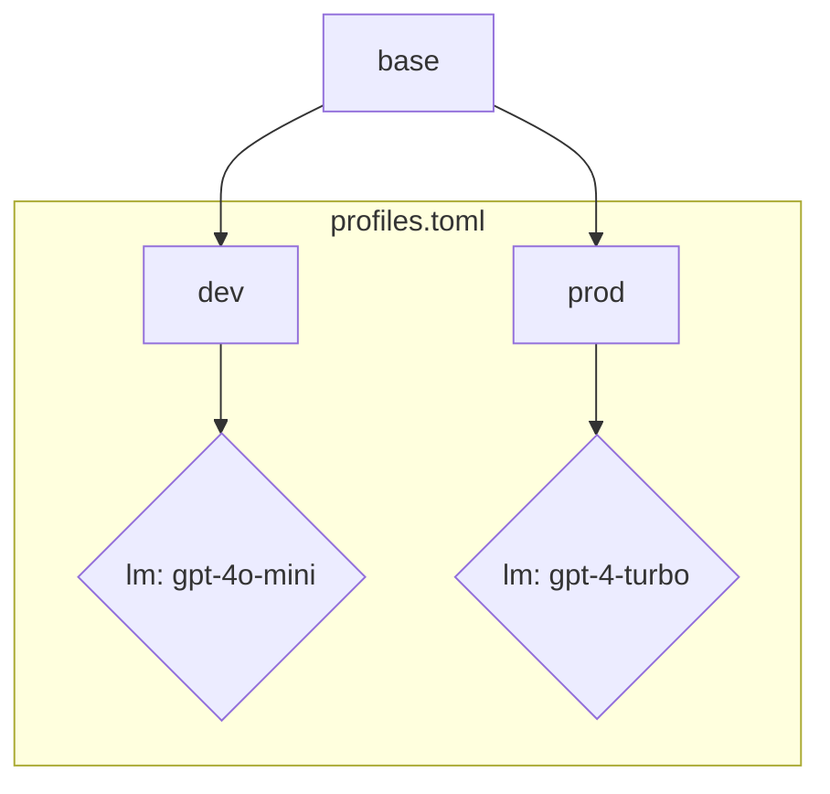

# Quickstart

This guide will walk you through the basics of setting up and using `dspy-profiles`.

## 1. Installation

First, install the package from PyPI:

=== "uv"

    <!-- termynal -->

    ```
    $ uv add dspy-profiles
    ---> 100%
    Installed
    $ uv run dspy-profiles --version
    dspy-profiles version: {{ version }}
    ```

=== "pip"

    <!--termynal: {title: zsh, prompt_literal_start: [$]}-->

    ```
    $ pip install dspy-profiles
    ---> 100%
    Installed
    ```

=== "uvx"

    <!--termynal: {title: zsh, prompt_literal_start: [$]}-->

    ```
    $ uvx run dspy-profiles --version
    dspy-profiles version: {{ version }}
    ```

=== "uv tool"

    <!--termynal: {title: zsh, prompt_literal_start: [$]}-->

    ```
    $ uv tool install dspy-profiles
    ---> 100%
    Installed
    $ dspy-profiles --version
    dspy-profiles version: {{ version }}
    ```

## 2. Core Concepts

A **profile** is a named collection of settings for DSPy. It can define:

-   A Language Model (`lm`)
-   A Retrieval Model (`rm`)
-   Global settings (e.g., `cache_dir`, `retries`)

Profiles are stored in a `profiles.toml` file. `dspy-profiles` locates this file with a clear, `git`-like precedence:

1.  **Project-Specific File**: It searches for a `profiles.toml` in the current directory and its parent directories.
2.  **Environment Variable**: You can set the `DSPY_PROFILES_PATH` environment variable to point to a specific configuration file.
3.  **Global File**: If neither of the above is found, it falls back to the global default at `~/.dspy/profiles.toml`.

By default, the `init` command will create or edit the global file.

### Profile Inheritance

Profiles can inherit and extend other profiles using the `extends` key. This allows you to create a base configuration and then create specialized variations without repeating yourself.

For example, you could have a `base` profile with common settings, and `dev` and `prod` profiles that extend it but use different language models.



## 3. Initialize Your First Profile

The easiest way to get started is with the interactive `init` command. This will create a `default` profile for you.

=== "uvx"

    <!--termynal: {title: zsh, prompt_literal_start: [$]}-->

    ```
    uvx dspy-profiles init
    ```
=== "uv tool"

    <!--termynal: {title: zsh, prompt_literal_start: [$]}-->
    ```
    dspy-profiles init
    ```

This command will ask for the language model, and optionally, your API key and an API base. It will then create the configuration file at `~/.dspy/profiles.toml`.

!!! warning "WARNING"
    If you provide an API key, it will be stored in plaintext in the configuration file. Please ensure that this file is kept secure and is not committed to version control.

## 4. View Your Profile

You can view the contents of any profile with the `show` command:

=== "uvx"
    <!--termynal: {title: zsh, prompt_literal_start: [$]}-->
    ```
    uvx dspy-profiles show default
    ```

=== "uv tool"
    <!--termynal: {title: zsh, prompt_literal_start: [$]}-->
    ```
    dspy-profiles show default
    ```

## 5. Using Profiles in Your Code

`dspy-profiles` provides multiple ways to activate a profile, catering to different use cases.

=== "Context Manager"

    The `profile` context manager is the most common way to activate a profile for a specific block of code.

    ```python
    import dspy
    from dspy_profiles import profile

    # DSPy settings are configured automatically within this block
    with profile("default"):
        predictor = dspy.Predict("question -> answer")
        result = predictor(question="What is the color of the sky?")
        print(result.answer)
    ```

    Any DSPy calls made inside the `with` block will use the settings from your `default` profile. Outside the block, the global DSPy settings are left untouched.

=== "Decorator"

    The `@with_profile` decorator is useful for applying a profile to an entire function.

    ```python
    import dspy
    from dspy_profiles import with_profile

    @with_profile("default")
    def my_dspy_program(question):
        predictor = dspy.Predict("question -> answer")
        return predictor(question=question)

    result = my_dspy_program("What is the capital of Spain?")
    print(result.answer)
    ```

=== "CLI `run` Command"

    For running entire scripts, the `run` command is the most convenient option. It activates a profile for the entire duration of the script's execution.

    Create a file named `my_script.py`:

    ```python
    # my_script.py
    import dspy

    # No need for a context manager, the profile is active!
    predictor = dspy.Predict("question -> answer")
    result = predictor(question="What is the capital of Spain?")
    print(f"The capital of Spain is {result.answer}.")
    ```

    Now, run it with your profile:

    === "uvx"
        <!--termynal: {title: zsh, prompt_literal_start: [$]}-->
        ```
        uvx dspy-profiles run --profile default -- python my_script.py
        ```
    === "uv tool"
        <!--termynal: {title: zsh, prompt_literal_start: [$]}-->
        ```
        dspy-profiles run --profile default -- python my_script.py
        ```

## 6. Next Steps

You've now learned the basics of `dspy-profiles`. From here, you can:

-   Explore the **CLI Reference** to see all available commands.
-   Dive into the **API Reference** for advanced usage.
-   Learn about creating more complex profiles with inheritance.
